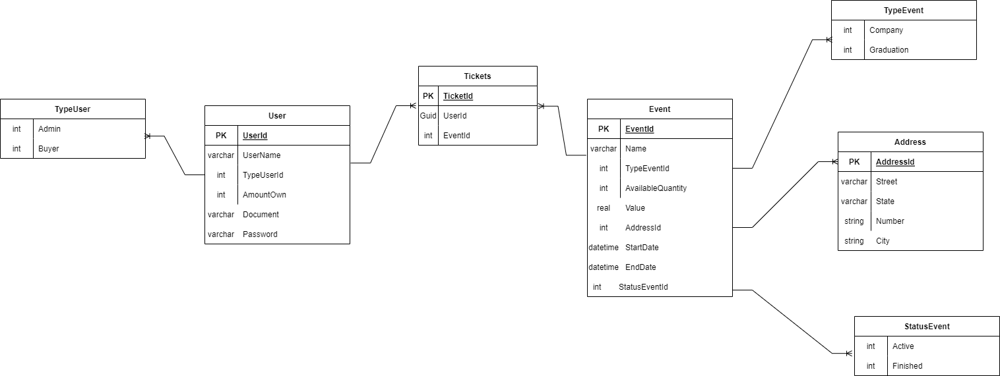

# Compra-Ingressos

## Descrição

 
​
Back-end de um sistema que permite a compra e venda de ingresso para eventos de empresas e universidades. O sistema permitirá que usuários possam cadastrar seus ingressos para eventos,
e que outros usuários possam visualizar e comprar esses ingressos.
​ 
​ 
Será possivel criar dois tipos de usuário, um para criar os eventos e outro para comprar.

 

## Diagrama

 

## Tecnologias:

- C#
- .NET5
- Entity Framework
- Authentication JwtBearer
- SqLite

## Regras de Negócio

- Usuário:

  - Não pode criar usuários com **dois documentos iguais**.
  - O **AmountOwn** sempre inicia com valor zero.
  - Usuário do tipo **Admin** não pode comprar ingressos.
  - Usuário do tipo **Buyer** não pode cadastrar ingressos.
  - O **Password** tem que ter no mínimo seis e no máximo trinta caracteres.

- Eventos:
  - Não é possível criar um evento com a **EndDate** inferior a **StartDate**.
  - Não é possivel comprar ingresso se o status do evento for **Finished**.
  - Não é possivel comprar ingresso se houver acabado a quantidade disponível - **AvailableQuantity**.
  - Não é possivel comprar ingresso se houver passado da data **EndDate**.
